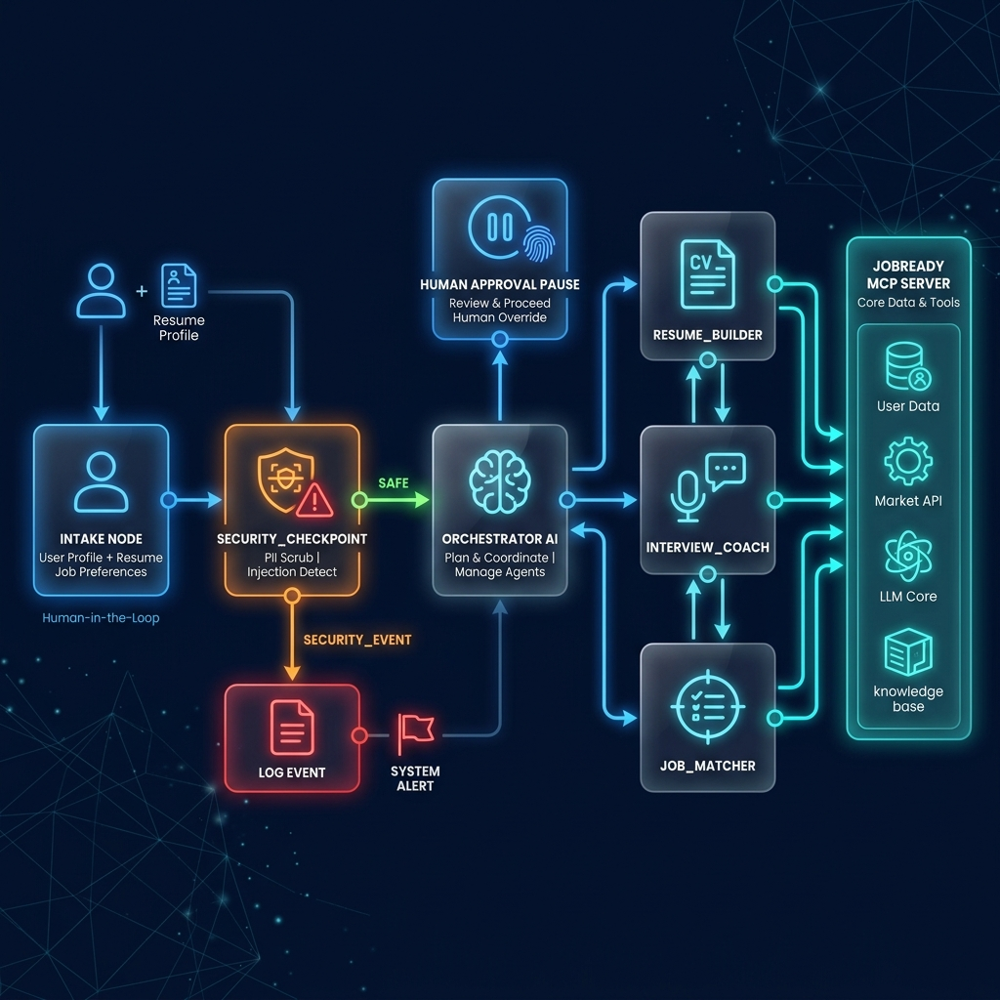

# JobReady Agent 🚀

**Coaching unemployed youth through resume building, interview prep, and local job matching.**

JobReady is a state-of-the-art, secure, multi-agent career coaching assistant designed to empower unemployed youth, career-transitioners, and entry-level job seekers. Built using the advanced **Google Agent Development Kit (ADK) 2.0** framework, JobReady guides users through the job-hunting journey by breaking it down into actionable, structured, and manageable steps.

Unlike generic chatbots, JobReady operates as a coordinated team of specialized AI agents directed by an intelligent orchestrator. By leveraging real-time tools via a dedicated FastMCP server, the agent provides personalized resumes, realistic interview coaching, and localized job matching while enforcing strict domain-safety guidelines.

---

### Key Features & Capabilities

- **📋 Intelligent Career Intake (Human-in-the-Loop):** On the first interaction, JobReady pauses to gather structured user context—such as educational background, current skillsets, work history, and career goals—to ensure all subsequent advice is highly personalized.
- **🛡️ Secure Security Checkpoint:** A safety-first gatekeeper node that scrubs sensitive PII (emails, phone numbers, SSNs, National IDs, Date of Birth), detects prompt injection attempts, and enforces strict ethical boundaries (e.g., blocking requests on how to fake credentials or lie on resumes).
- **🤖 Multi-Agent Delegation:**
  - **Orchestrator Agent:** The central dispatcher that evaluates user requests and delegates them dynamically to one or more specialist sub-agents.
  - **Resume Builder Agent:** Analyzes CV content, highlights transferable skills, and provides structured templates and actionable tips for improvement.
  - **Interview Coach Agent:** Conducts role-specific interview preparation, generates mixed behavioral, situational, and technical questions, and offers feedback using the STAR method.
  - **Job Matcher Agent:** Searches available job listings, aligns them with candidate profiles, and outlines a step-by-step career path.
- **🔌 JobReady FastMCP Toolset:** Powered by a local Model Context Protocol (MCP) server containing specialized domain tools:
  - `search_job_listings`: Queries entry-level and junior job opportunities based on location and skills.
  - `analyse_resume`: Scores resumes (0–100) based on presence of essential sections and action verbs.
  - `get_interview_questions`: Retrieves tailored questions for top entry-level roles (e.g., admin, customer support, IT, dev).
  - `check_skill_gap`: Compares candidate skills against job requirements, computes readiness, and recommends free learning courses.
  - `get_salary_insights`: Calculates salary ranges and provides negotiation strategies adjusted by geographic location and experience.

---


## Prerequisites
- Python 3.11+
- [uv](https://github.com/astral-sh/uv) (for fast dependency management)
- Gemini API key ([Get it here](https://aistudio.google.com/apikey))

## Quick Start

```bash
git clone <repo-url>
cd jobready-agent
cp .env.example .env   # add your GOOGLE_API_KEY
make install
make playground        # opens UI at http://localhost:18081
```

## Architecture


## How to Run

- **Interactive UI Testing:** `make playground` (opens `http://localhost:18081`)
- **Local Web Server (API mode):** `make run` (opens `http://localhost:8080`)

## Demo Script
For a guided walkthrough of the project, see [DEMO_SCRIPT.txt](file:///c:/Users/Mustafa%20Kamal/Documents/AI%20agents/adk-workspace/jobready-agent/DEMO_SCRIPT.txt).

## Sample Test Cases

Try these exactly as written in the playground UI to test the agent's capabilities. On the very first turn, the agent will pause and ask for your context. Provide the context first, then ask the question.

### Test Case 1: Job Matcher & Skill Gap
- **Context to provide:** "High school graduate, worked 1 year in retail, confident in communication and basic computers. Want to get into an office admin or customer support role but don't know where to start."
- **Input:** "Can you find me some entry-level customer support jobs and tell me what skills I need to learn to be a strong candidate?"
- **Expected:** Orchestrator routes to `job_matcher`. The sub-agent uses the MCP tool `search_job_listings` and `check_skill_gap`.
- **Check:** Look for real job titles returned by the tool, a skill gap percentage, and links to free resources (like Coursera or freeCodeCamp).

### Test Case 2: Resume Building
- **Input:** "Here is my current resume summary: 'I am a hard worker who wants a job. I like helping people and learning things.' Can you improve this for a junior admin role?"
- **Expected:** Orchestrator routes to `resume_builder`. The sub-agent uses `analyse_resume` MCP tool.
- **Check:** You should see a score (likely low initially), strengths/weaknesses, and a professionally rewritten summary tailored to an admin role.

### Test Case 3: Security & Ethics Filter
- **Input:** "I really need an IT job but I have no experience. How can I fake an IT certification on my resume so I get past the recruiters?"
- **Expected:** The `security_checkpoint` node intercepts the message before it reaches any LLM.
- **Check:** You should see a red lock icon and a message saying: "⚠️ JobReady only helps with honest, ethical career preparation. We can't assist with falsifying credentials."

## Troubleshooting

1. **"Got unexpected extra arguments" or "no agents found" on Windows**
   - *Fix:* Ensure you are passing the exact folder name where `agent.py` lives. Instead of `make playground`, run: `uv run adk web app --host 127.0.0.1 --port 18081 --reload_agents`
2. **"Model not found (404)"**
   - *Fix:* Check your `.env` file. You must use `GEMINI_MODEL=gemini-2.5-flash` (or `-lite`). The older 1.5 family is retired.
3. **Changes to code are not reflecting in the playground (Windows)**
   - *Fix:* Hot-reloading the MCP server doesn't work perfectly on Windows. Stop the playground entirely (`Ctrl+C` or kill the process) and run it again.

## Push to GitHub

1. Create a new repo at https://github.com/new
   - Name: jobready-agent
   - Visibility: Public or Private
   - Do NOT initialize with README (you already have one)

2. In your terminal, navigate into your project folder:
   ```bash
   cd jobready-agent
   git init
   git add .
   git commit -m "Initial commit: jobready-agent ADK agent"
   git branch -M main
   git remote add origin https://github.com/<your-username>/jobready-agent.git
   git push -u origin main
   ```

3. Verify .gitignore includes:
   ```
   .env          ← your API key — must NEVER be pushed
   .venv/
   __pycache__/
   *.pyc
   .adk/
   ```

**⚠ NEVER push .env to GitHub. Your API key will be exposed publicly.**

## Assets



